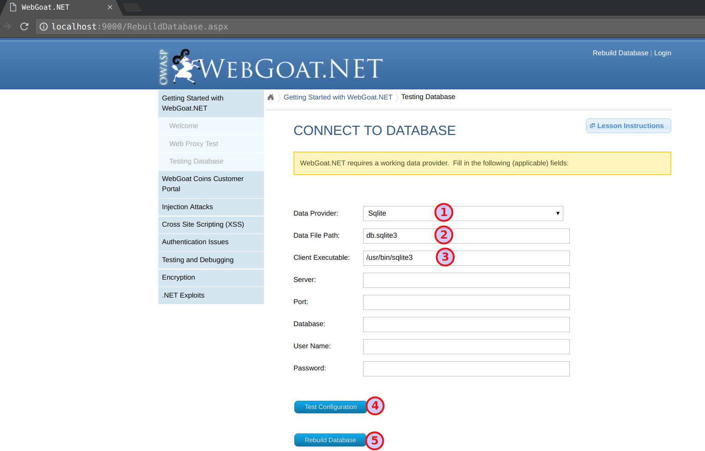

# OWASP WebGoat.NET Docker Container

`OWASP WebGoat.NET` is a purposefully broken `ASP.NET` web application. It contains many common vulnerabilities, and is intended for use in classroom environments. Refer to [https://www.owasp.org/index.php/Category:OWASP_WebGoat.NET](https://www.owasp.org/index.php/Category:OWASP_WebGoat.NET) for more details.


## Software required to use docker container

* Docker 


## Steps to use the container

```bash
docker run --name webgoat -it -p 9000:9000 -d appsecco/owasp-webgoat-dot-net
```

* Then navigate to http://localhost:9000 to access the `OWASP WebGoat.NET` application

* First time we have to setup the database by giving the path to sqlite click on `Test Configuration` then `Rebuild Database`



* Now you all set to use the `OWASP WebGoat.NET` application 


## Thanks

Please feel free to make a pull request or tweet to me [@madhuakula](https://twitter.com/madhuakula) for improvements and suggestions.